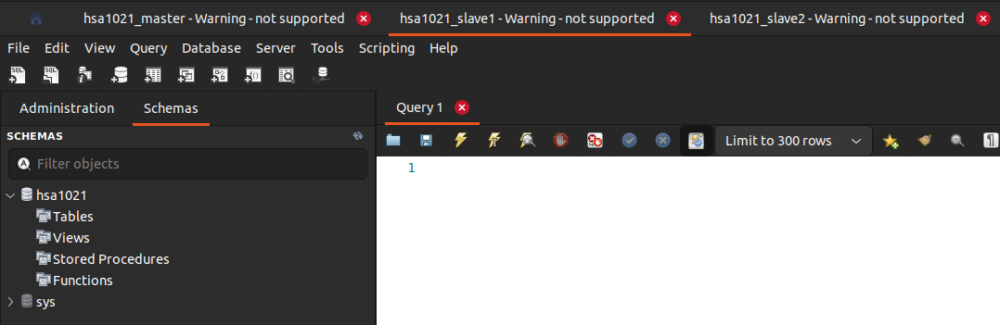
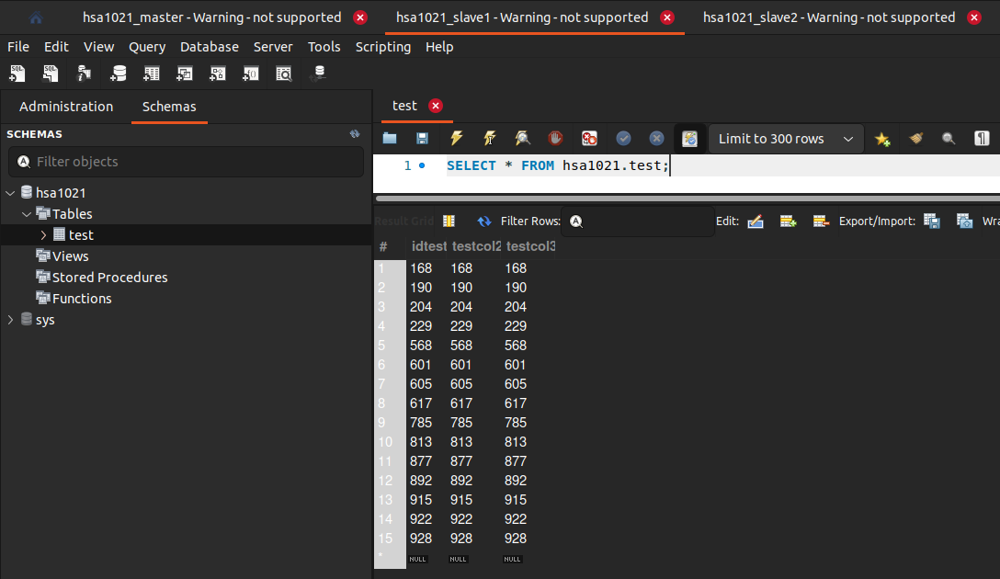

# MySQL Replication(Master-Slave) 

## Conclusions

#### MIXED BIN LOG FORMAT

    1. Master is ok.
    2. Slave1 is out of sync after deleting some columns.
    3. Slave2 is in sync after startup.

#### ROW BIN LOG FORMAT

    1. Master is ok.
    2. Slave1 is in sync after deleting columns.
    3. Slave2 is in sync after startup.

#### STATEMENT BIN LOG FORMAT

    1. Master is ok.
    2. Slave1 is out of sync after deleting some columns.
    3. Slave2 is in sync after startup.

## More detailed explanation is down below ↓↓↓↓

## Setup

To run the MySQL nodes and create a cluster from them just run a bash stript named `setup.sh`.

```bash
bash setup.sh
```

Afterall you'll se a result similar to this one: 

```bash
Creating network "hsa1021" with the default driver
Creating hsa1021-mariadb-slave2 ... done
Creating hsa1021-mariadb-master ... done
Creating hsa1021-mariadb-slave1 ... done
ERROR 2002 (HY000): Can't connect to local server through socket '/run/mysqld/mysqld.sock' (2)
Waiting for mysql_master database connection...
ERROR 1045 (28000): Access denied for user 'root'@'localhost' (using password: YES)
Waiting for mysql_master database connection...

current log: mysql-bin.000002
current pos: 996

slave1 status: 
    Slave_IO_State: Waiting for master to send event 
    Master_Host: hsa1021-mariadb-master 
    Master_User: slave1 
    Master_Port: 3306 
    Connect_Retry: 60 
    Master_Log_File: mysql-bin.000002 
    Read_Master_Log_Pos: 996 
    Relay_Log_File: mysql-relay-bin.000002 
    Relay_Log_Pos: 555 
    Relay_Master_Log_File: mysql-bin.000002 
    Slave_IO_Running: Yes 
    Slave_SQL_Running: Yes 
    Replicate_Rewrite_DB: 
    Replicate_Do_DB: 
    Replicate_Ignore_DB: 
    Replicate_Do_Table: 
    Replicate_Ignore_Table: 
    Replicate_Wild_Do_Table: 
    Replicate_Wild_Ignore_Table: 
    Skip_Counter: 0 
    Exec_Master_Log_Pos: 996 
    Relay_Log_Space: 864 
    Until_Condition: None 
    Until_Log_File: 
    Until_Log_Pos: 0 
    Seconds_Behind_Master: 0 
    Master_Server_Id: 1 
    SQL_Delay: 0 
    SQL_Remaining_Delay: NULL 
    Slave_SQL_Running_State: Slave has read all relay log; waiting for more updates 

current log: mysql-bin.000002
current pos: 996

slave2 status: 
    Slave_IO_State: Waiting for master to send event 
    Master_Host: hsa1021-mariadb-master 
    Master_User: slave2 
    Master_Port: 3306 
    Connect_Retry: 60 
    Master_Log_File: mysql-bin.000002 
    Read_Master_Log_Pos: 996 
    Relay_Log_File: mysql-relay-bin.000002 
    Relay_Log_Pos: 555 
    Relay_Master_Log_File: mysql-bin.000002 
    Slave_IO_Running: Yes 
    Slave_SQL_Running: Yes 
    Replicate_Rewrite_DB: 
    Replicate_Do_DB: 
    Replicate_Ignore_DB: 
    Replicate_Do_Table: 
    Replicate_Ignore_Table: 
    Replicate_Wild_Do_Table: 
    Replicate_Wild_Ignore_Table: 
    Last_Errno: 0 
    Last_Error: 
    Skip_Counter: 0 
    Exec_Master_Log_Pos: 996 
    Relay_Log_Space: 864 
    Until_Condition: 
    None Until_Log_File: 
    Until_Log_Pos: 0 
    Seconds_Behind_Master: 0 
    Master_Server_Id: 1 
    SQL_Delay: 0 
    SQL_Remaining_Delay: NULL 
    Slave_SQL_Running_State: Slave has read all relay log; waiting for more updates 
```

## Overview

Empty master node


Empty slave1 node



Empty slave2 node


## It's working!!

To see if our cluster is working we can run to other `.sh` files.

```bash
bash create_test_table.sh
bash generate_test_data.sh
```

Filled master node


Filled slave1 node


Filled slave2 node


## MIXED BIN LOG FORMAT Tests

Shutting down slave2 node, removing last column from the slave1 table and generating some data.

```bash
docker stop hsa1021-mariadb-slave2

docker exec hsa1021-mariadb-slave1 bash -c "export MYSQL_PWD=mysqlslave1pass; mariadb -u root -e 'ALTER TABLE `hsa1021`.`test` 
DROP COLUMN `testcol4`;'"

bash generate_test_data.sh
```

Let's see the results:

Master node(all is fine)


Slave1 node(data is not synchronized)


Staring up slave2 node:

```bash
docker start hsa1021-mariadb-slave2
```

Slave2 node(data is synchronized)


## ROW BIN LOG FORMAT Tests

Shutting down slave2 node, removing last and second column from the slave1 table and generating some data.

```bash
docker stop hsa1021-mariadb-slave2

docker exec hsa1021-mariadb-slave1 bash -c "export MYSQL_PWD=mysqlslave1pass; mariadb -u root -e 'ALTER TABLE `hsa1021`.`test` DROP COLUMN `testcol4`, DROP COLUMN `testcol1`;'"

bash generate_test_data.sh
```

Master node(all is fine)


Slave1 node(data is synchronized)



Slave2 node after the startup is also fine.

## STATEMENT BIN LOG FORMAT Tests

On current tests results are the same as in `MIXED` format.